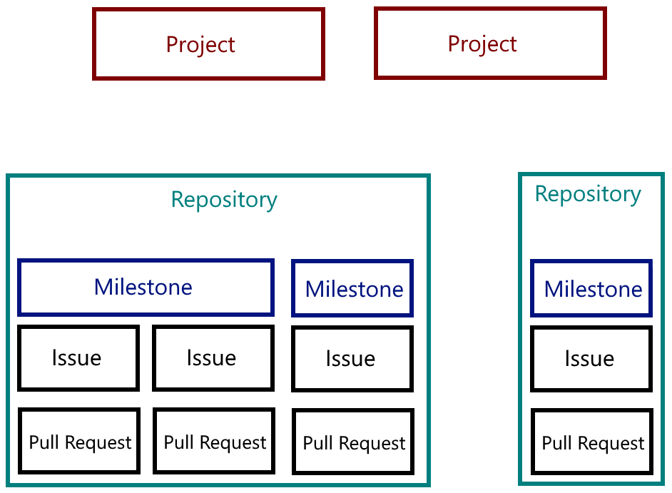
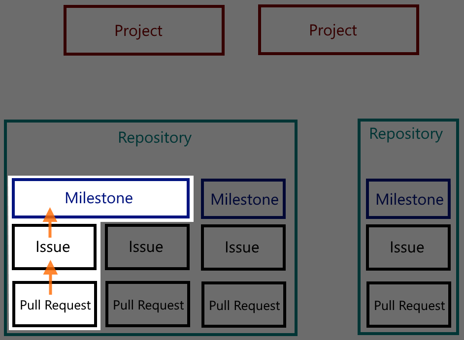
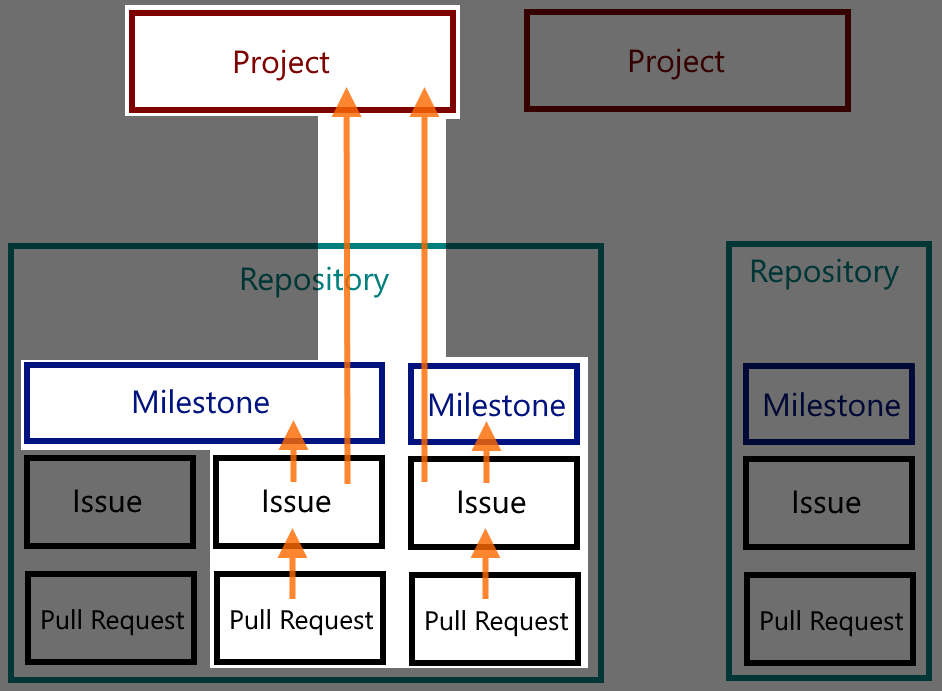
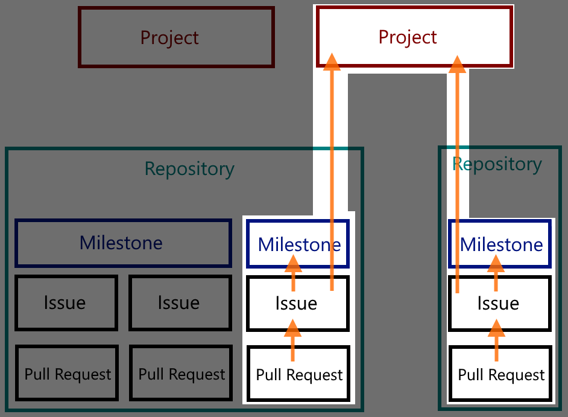

# Project Management

We use Github [Issues](https://help.github.com/articles/about-issues/), [Milestones](https://help.github.com/articles/about-milestones/) and [Projects](https://help.github.com/articles/about-project-boards/) to track and mange the work for the organization

* [Issues](#Issues)
* [Pull Requests](#Pull%20Requests)
* [Milestones](#Milestones)
* [Projects](#Projects)

## Issues

Issues represent individual units of work, whether they be a bug or feature or whatever.
Each Issue must be tagged for a milestone if its being worked on.
Each issue _may_ be tagged with one or more projects, depending on its complexity or its scope.
For example, a documentation error would not be assoicated with the `Big Feature Project` but would still have a `0.13 milestone`.

## Pull Requests

Work/Code/Changes will be introduced into repositories using Pull Requests (PRs) targeted to the repo master from a branch in the submitter's fork.
No commits or pushes directly to the main branch.
PRs will not be merged without passing both CI and a code review.

* Each PR _will_ address one or more Issues
* Each PR _will_ be tagged to a single Milestone
* Each PR _may_ be tagged with one or more projects

For example the work in a example PR #1 is part of the `Big Feature Project` and the `0.13 Release Project`.
This shows the completion progress for the `Big Feature` as well as the overall progress for the `0.13` release.
Simple PRs like a minor documentation change or a maintenance commit would not be associated with a `Project`, but are still tracked because they are tagged with a `Milestone`.

## Milestones

`Milestones` are versioned and used to track the planned, in progress, and completed work of a **_single_** repository (see [Projects](#Projects) for explanation of multi-repository releases).
*Milestones* are not _features_, in that they are not tied to any one feature.
They are indications of what will be delivered when the repo makes a release.
These releases may not result in a public release (for example a VSCode marketplace release), but are used to track history of the repository.
In short, these are version milestones not feature buckets.

Milestones provide an easy reference for status of work currently planned or in progress within a single repo.
They are also used for creating/validating a CHANGELOG for a release for a single repo.

## Projects

Projects are used to track complicated work in a single repository, to coordinate work across multiple repositories, or to track public VSCode marketplace releases.

Only two types of projects are allowed: **Releases** and **Features**

### Releases

* Correlate to VSCode marketplace releases
* Encompass all work done for that release
* Can contain issues/prs from just one, or more than one repo

### Features

* Do not correlate to any release, can span releases
* Contains issues and PRs that encompass work done in more than one repository
* Does not contain issues/prs that are only in one repo
* Can live longer than a Release project

This type of work typically needs more than one issue to be created to describe the work to be done, and a `project` keeps all of those issues in one place.
This type of work can also span more than one repository, in that we need to work on the client (puppet-vscode) and the server (puppet-editor-services) and a `project` provides a way to track issues within those two repos.

Since a VSCode marketplace release comprises work from client (puppet-vscode) and the server (puppet-editor-services), we create a release project to track the progress of a marketplace release.

---

## Examples

If we have a collection of Projects, Repositories, Milestones, Issues, and Pull Requests

---

### A maintence change

A maintenance or documentation change is a simple issue which does not require a project, but would be tracked for a release with a repo milestone.
This would look like the following:

---

### A complicated feature project

A feature that is complicated will contain one or more issues.
These issues might be contained in one milestone, or can span milestones.
This would look like the following:

---

### A cross repository project

A feature that spans across multiple projects would look like the following:

